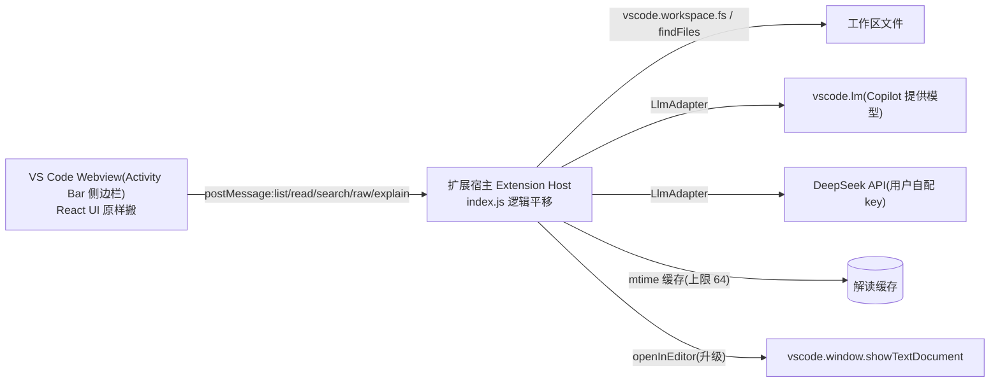

# dsh-files → VS Code 扩展迁移设计

> **状态**:设计稿,待评审
> **目标产物**:`vscode-files-explain`(暂定名)— 把 dsh-files 的「文件树 + 预览 + 逐函数 AI 解读 + mermaid 调用图」完整搬进 VS Code 侧边栏
> **结论先行**:可行,且 dsh-files 是形态最有利的移植类型 —— 全部 DSH 依赖集中在边缘,中间约 90% 代码可原样搬

---

## 1. 背景与目标

dsh-files(自研,0.1.0)是 DeepSeek Harness 的「文件」右侧边栏插件。移植到 VS Code 的目标:

1. 复用现有全部功能与 UI,不降级;
2. 宿主侧换成 VS Code Extension API,客户端侧 React 代码零重写(仅换入口与通信层);
3. 补齐 VS Code 生态里稀缺的「逐函数中文解读 + 调用图 + mtime 缓存」能力,作为扩展核心卖点。

## 2. 现状盘点(代码事实)

### 2.1 结构

| 文件 | 行数 | 职责 |
| --- | --- | --- |
| `packages/dsh-files/lib/index.js` | 1125 | 宿主半部:5 条 HTTP 路由 + 解读流水线 |
| `packages/dsh-files/lib/client.js` | 3348 | 客户端半部:侧栏面板 UI(React DOM,自包含) |
| `cordis.patch.yml` / `package.json` | — | DSH 安装与注入声明(移植后删除) |

### 2.2 宿主侧依赖清单(`index.js`)

| 位置 | 依赖 | 用途 | 移植处理 |
| --- | --- | --- | --- |
| L22 `inject=['fs']` | DSH 沙箱 `fs` 服务 | resolve/stat/listDir/read | 换成 `vscode.workspace.fs`,写 FsAdapter 镜像原接口 |
| L129-160 `resolveRoute` | `ctx.get('llm')` + `ctx.get('agentDefaultModel')` | 模型路由:flash 优先 → 默认选择 → 首个 provider | 换成 LlmAdapter 的 `resolveRoute`(见 §7 D1) |
| L165-189 `llmCall` | `llm.stream({...})` | 一次性流式调用,120s 超时,signal 中断 | `vscode.lm` 的 `sendRequest(messages,{},token)` / DeepSeek SSE 流 |
| L769-776 `registerWeb` | `ctx.get('webServer')` | 注册 5 条路由 | 换成 `webview.onDidReceiveMessage` 消息处理器 |
| L1122-1124 | `ctx.on('internal/service')` | 服务迟到时重注册路由 | 删除(VS Code 无动态服务) |

### 2.3 客户端侧依赖清单(`client.js`)

| 位置 | 依赖 | 用途 | 移植处理 |
| --- | --- | --- | --- |
| L464-473 `api` 对象 | `fetch('/plugins/dsh-files/*')` | 全部后端调用(4 个方法) | 换成 `vscode.postMessage` + Promise 关联,签名不变 |
| L579/593 | `raw?path=...` URL 直嵌 img/iframe | 图片/PDF 字节流 | 换成 postMessage 取 base64 data URI(现成 `/raw` 逻辑平移) |
| L487-510 | `window.__GenuiAssets__` / DSH boot graph | 借用 `@omdsh-dev/dsh-genui` 的 mermaid 引擎 | mermaid 从 npm 打包进 webview bundle |
| L1809-1811 | slot props `useSessions` / `useWorkspaces` | 拿当前会话对应工作区 | 换成 `workspace.workspaceFolders`(host 启动时推送 + 变更通知) |
| L1819-1831 | 工作区推导链:会话→最近→首个 | rootPath 选择 | 换成多根选择器(§7 D4) |
| L3308-3342 `apply()` | `ctx.effect`、`ctx.get('slots')`、两个 slot 注册 | 生命周期 + 面板挂载 + 标题栏开关 | webview 启动引导;标题栏开关换成 activity bar 图标 |
| L475 `inject=["slots"]` | slots 服务 | 同上 | 删除 |

> 关键结论:客户端 3348 行中与 DSH 运行时交互的代码 **不足 60 行**,且全部集中在 `api` 对象、`GuidePanel` 的 props 解构和 `apply()` 三个点上。这是移植成本低的根本原因。

### 2.4 可整体复用的纯逻辑(零改动搬运)

| 资产 | 位置 | 说明 |
| --- | --- | --- |
| 三段 prompt(SINGLE/OUTLINE/EXPLAIN) | index.js L41-127 | 解读契约:`functions[]`(name/start/end/signature/summary/flow/formula)+ `callEdges[]` |
| 两段式解读流水线 | index.js L24-39 常量 + 主体 | outline 定位 → 分组 explain(并发 3)→ 按名合并,1:1 镜像源码函数 |
| 解读缓存 | index.js L766 | path → {mtime, data},上限 64 条 |
| 工作区包含校验 | index.js L783-795 `insideRoot` | root 边界守卫,原样保留(换成 Uri 比较) |
| 全部 React UI | client.js 主体 | 文件树/搜索/图标/虚拟滚动/逐行高亮/Markdown+mermaid 预览/解读交互/鲸鱼娘看板 |
| Material 文件类型图标 | client.js 内嵌 | 来自 PKief/vscode-material-icon-theme(MIT),保留并继续在 NOTICE 声明 |

## 3. 目标架构

### 3.1 选型:WebviewView,不用 TreeView

| 方案 | 优点 | 缺点 |
| --- | --- | --- |
| **WebviewView(选定)** | React 代码 ~95% 复用;搜索栏/大小/彩色图标/展开折叠全部保留;体验与 DSH 版一致 | 非原生控件(键盘/主题需手动对齐) |
| TreeDataProvider 原生树 | 原生键盘导航、主题自动 | 文件树重写,丢掉搜索/大小/图标等已实现功能;预览仍需 webview,两套 UI 并存 |

> 「不做」清单:不用 TreeView 重写文件树;不自建原生 Ctrl+F(webview 内已实现);不依赖 CDN 加载 mermaid。

## 4. 消息协议(postMessage)

与 HTTP 路由 **1:1 对应**,宿主侧处理函数签名不变:

| 消息 | 请求 payload | 响应 | 原路由 |
| --- | --- | --- | --- |
| `list` | `{path, root}` | `{entries}` / `{error}` | `/list` |
| `search` | `{root, q}` | `{entries}` / `{error}` | `/search` |
| `read` | `{path, root}` | 文件内容 / `{binary:true}` / `{error}` | `/read` |
| `raw` | `{path, root}` | `{base64, mime}`(≤20MB) | `/raw` |
| `explain` | `{path, refresh, root}` | 解读 JSON(契约不变) | `/explain` |
| `openInEditor`(新增) | `{path, line?}` | 宿主 `showTextDocument` + `revealRange` | —(升级:替代 webview 内 Ctrl+点击跳转) |
| `workspace/change`(宿主→webview) | `{folders:[{path,title}]}` | 工作区切换推送 | —(替代 slot props) |

实现要点:

- 每个请求带 `id`,webview 侧 Promise 表按 id 关联响应(现有 `api.*` 返回 Promise 的调用形态完全不变);
- `explain` 为长任务:宿主用 `window.withProgress` 展示进度,中断用 AbortController 传递;
- 图片/PDF:postMessage 返回 base64,webview 构造 data URI(现有 img/iframe 用法不变);20MB 上限保留。

## 5. 逐层迁移映射

### 5.1 宿主侧(extension.js)

1. **删**:`inject`、`ctx`、`registerWeb`、路由注册、`ctx.on('internal/service')`(约 120 行);
2. **增**:`activate(context)`、`registerWebviewViewProvider`、消息分发器(按 §4 协议);
3. **写 FsAdapter**(约 100 行):镜像原 `fs` 服务的方法签名
   - `resolve(path)` → `vscode.Uri.file(path)` + 存在性检查;
   - `stat/listDir/read` → `workspace.fs.stat/readDirectory/readFile`;
   - `targetKey`(原沙箱 key)→ `Uri.fsPath` 规范化;
   - 文件名搜索 `search` → `workspace.findFiles`(全局索引,带默认 exclude);
4. **写 LlmAdapter**(约 150 行):保留 `resolveRoute` 的优先级思想(§7 D1),统一 `stream({provider, model, system, messages, maxTokens, temperature, signal})` 调用面;
5. **保留不动**:三个 prompt、两段式流水线、合并逻辑、缓存、`insideRoot` 边界校验。

### 5.2 客户端侧(webview entry)

1. **删**:`__ModuleLoader__.load` 包裹、`exports.apply/inject`、`slots.inject/register`、`ctx.effect` 清理器(webview 销毁即清理,`retainContextWhenHidden:true` 保活)、`useSessions/useWorkspaces` props;
2. **改**:`api` 对象 4 个方法 → postMessage 版(签名不变,调用点零改动);
3. **增**:启动引导 —— `acquireVsCodeApi()`、初始工作区拉取、`workspace/change` 监听;
4. **保留不动**:其余 ~3200 行 UI,含 CSS(style 元素注入在 webview CSP 下合法)。

### 5.3 构建与清单

- esbuild 双产物:`dist/extension.js`(宿主)+ `dist/webview.js`(webview,含 mermaid);
- `package.json`:`engines.vscode ^1.90.0`(vscode.lm 稳定起点)、`activationEvents onView:dshFiles`、`contributes.viewsContainers.activitybar` + `views`(侧栏图标用 VS Code theme icons);
- webviewOptions:`retainContextWhenHidden: true`(自动刷新/布局持久化不丢);
- CSP:脚本全进 bundle(nonce 合规);样式 inline 允许;图片 data: 允许。

## 6. 关键决策

### D1 LLM 后端(双通道,默认 Copilot)

| 通道 | 条件 | 优点 | 缺点 |
| --- | --- | --- | --- |
| `vscode.lm.selectChatModels({vendor:'copilot'})` | 用户装 Copilot 且登录 | 零 key 管理;符合 VS Code 习惯 | 模型由 Copilot 定;无 Copilot 即不可用 |
| DeepSeek API(设置里填 key) | 用户自配 | 与 DSH 同源模型(deepseek-v4-flash 优先) | 用户需管理 key |

> 保留原 `resolveRoute` 的三级回退思想:配置的 DeepSeek → vscode.lm 的 Copilot → 报错提示去设置。扩展设置页提供 key 输入与模型选择。

### D2 仓库位置与包名

- 建议:本仓库新建顶层目录 `vscode-files-explain/`(独立扩展,共享 git 历史与 NOTICE 素材声明);发布前可拆独立仓库;
- 包名按 Marketplace 唯一性校验后再定,`vscode-files-explain` 为候选。

### D3 发布渠道

- VS Code Marketplace(主)+ Open VSX(次,顺带覆盖 VSCodium 系);
- 发布物:esbuild 产物 + 精简 README + NOTICE(保留 material 图标 MIT 与鲸鱼娘二创声明)。

### D4 功能取舍

- **全部保留**:文件树/搜索/图标/展开折叠/自动刷新/多页签/虚拟滚动/逐行高亮/Markdown+mermaid/图片内嵌/解读看板/鲸鱼娘;
- **PDF**:默认内嵌预览(base64 平移),加「系统查看器打开」按钮(`vscode.env.openExternal`);
- **升级**:Ctrl+点击跳转定义 → `showTextDocument + revealRange` 打开真实编辑器(webview 内跳转保留为降级);
- **多工作区**:DSH 版是单根,VS Code 版树顶增加工作区切换器(`workspace.workspaceFolders`),「按当前活动文件所在工作区自动切换」作为默认行为。

## 7. 分阶段实施计划

| 阶段 | 内容 | 验收标准 | 预估 |
| --- | --- | --- | --- |
| P0 脚手架 | 目录/manifest/esbuild/空 webview 视图 | F5 调试启动,侧栏出现视图,双向消息通 | 0.5 天 |
| P1 客户端平移 | client.js 进 webview,api 换 postMessage | 文件树/搜索/预览/Markdown/mermaid 与 DSH 版一致 | 1–2 天 |
| P2 宿主平移 | index.js 消息处理器 + FsAdapter + LlmAdapter | 解读流水线跑通,缓存命中,越界 403 等价拦截 | 1–2 天 |
| P3 集成打磨 | 主题变量接 VS Code、retainContextWhenHidden、openInEditor、多工作区 | 浅/深色主题正常;切工作区树跟随;点行开编辑器定位 | 1–2 天 |
| P4 打包发布 | vsce package、README/NOTICE、Marketplace + Open VSX | 安装 vsix 可用;商店页合规 | 0.5–1 天 |

> 合计约 **4–7 个工作日**(单人)。若只做 MVP(文件树 + 预览 + 解读,砍 polish),P0–P2 约 **2–3 天** 可跑通。

## 8. 风险与对策

| 风险 | 影响 | 对策 |
| --- | --- | --- |
| 用户无 Copilot → vscode.lm 不可用 | 解读功能无模型 | DeepSeek key 兜底通道(必做);首启检测并引导设置 |
| `workspace.fs` 逐目录读比 Node fs 慢 | 大仓库树卡顿 | `findFiles` 全局索引做搜索;目录懒加载(现有缓存逻辑保留);默认 exclude `.git/node_modules` 等 |
| webview 隐藏即销毁 | 状态/刷新丢失 | `retainContextWhenHidden: true` |
| 长解读任务阻塞或中断 | 生成中无反馈 | `withProgress` + 消息 id 关联 + AbortController;沿用 120s 超时与并发 3 |
| Marketplace 审核/命名冲突 | 发布受阻 | 提前核名;README 合规(素材声明照搬 NOTICE) |
| mermaid 打包体积 | vsix 变大 | esbuild minify + 按需 chunk,可接受 |

## 9. 素材与许可(平移,不新增负担)

- Material 文件类型图标:PKief/vscode-material-icon-theme v5.37.0(MIT),已在 dsh-files NOTICE 声明;
- 鲸鱼娘看板图:DeepSeek 二创素材(github.com/1190fasheqi/dafeiyu-pet),保留出处注释与 NOTICE 条目;
- 三个 prompt 与解读流水线为自研代码,不受第三方协议约束。

## 10. 后续想法(与 DSH 版同步演进)

- 学习模式(空白模板 + AI 批改):两版可共享 prompt 设计;
- 解读持久化到项目目录(如 `.files-notes/`):VS Code 版天然适合(工作区可写),可先行落地;
- 若 VS Code 版跑通,可将「解读流水线 + LlmAdapter」沉淀为共享包,反向简化 dsh-files 的 host 半部。
